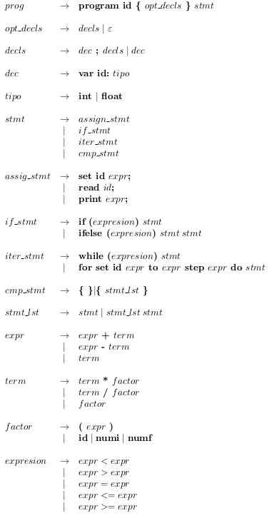

# Parser

Homework #4 from Compilers Design course. Given a [Context Free grammar](#context-free-grammar) program a syntax recognizer implementing a symbols table using Bison, Yacc, Flex and C.

## Compile

To **compile**, just type the _make_ command in the bash.

```bash
make
```

If it is **not possible**, enter the next instructions in the bash:

```bash
lex -l recognizer.l
bison -dv parser.y
gcc -o parser parser.tab.c lex.yy.c -lfl
```

## Execute

To **run** tests, type _make *<test_number>*_ in the bash.

* test_number = {one, two, three, four,  ... , eight}

 Example:

```bash
make one
make five
```

If it is **not possible**, enter the next instructions in the bash:

```bash
./parser < tests/one.txt
```

## Input

A text file with an example of any code under the [Context Free Grammar](#context-free-grammar) given.

## Output example

* Read and Print instructions.
* Errors, if any are found.
* Symbols table

```bash
Testing eight.txt
Read x: 45
Read y: 45
Assignation error!: z does not exist
Declaration error!: z was not declared
Assignation error!: z does not exist
syntax error
	variable  |	type 	|	value
	zz 		int 	
	y 		int 	
	x 		int 	 	45 

```

## Context Free Grammar



## Clean folder

Many files are autogenerated by _flex_ and _bison_. To clean the root folder, type:

```bash
make clean
```