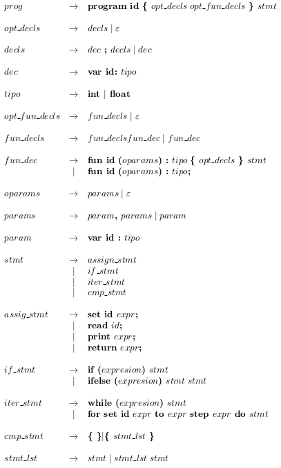
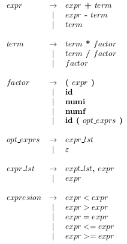

# Interpreter

Final project for for Compilers Design course, encompasing homeworks #4, #5 and #6.
Given a [Context Free grammar](#context-free-grammar) program an Intepreter which
implements all required symbol tables, a reduced syntax tree
and finally executes the instructions in said tree.

## Compilation

For convenience, the project may be compiled with GNU make. Just run the command:

```bash
make
```

To compile manually, one may run the following commands:

```bash
 lex -l recognizer.l
 bison -dv parser.y
 gcc -o interpreter function_table.c parser.tab.c lex.yy.c symbol_table/value.c symbol_table/symbol_table.c syntax_tree.c interpreter.c -lfl
```

## Execute

The makefile also defines commands to automatically run tests with the files in
the `tests` directory:

```bash
make one
make two
...
make twelve
make custom
```

## Run and print manually

The executable may be run manually on a given text file containing source code:

```bash
./interpreter tests/<file_name>.txt
```

If you wish to **print the syntax tree**, enter the next flag at the end of the previous instruction

```bash
--print-tree
```

## Context Free Grammar






## Clean folder

Many files are autogenerated by _flex_ and _bison_. To clean the root folder, type:

```bash
make clean
```